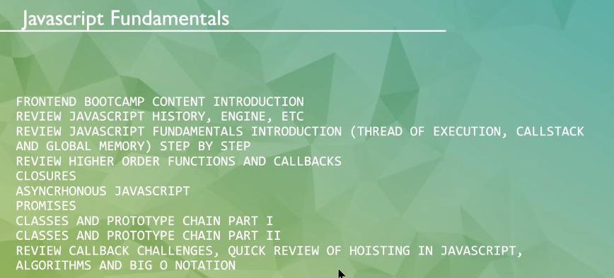
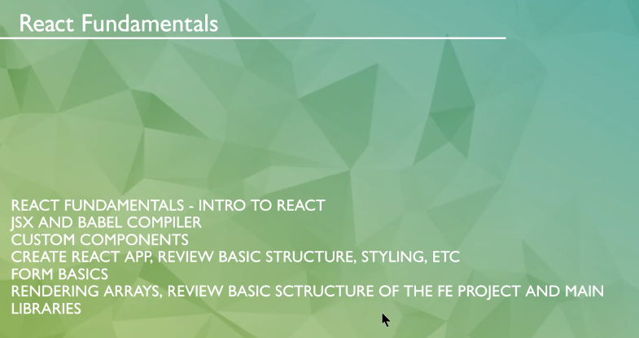
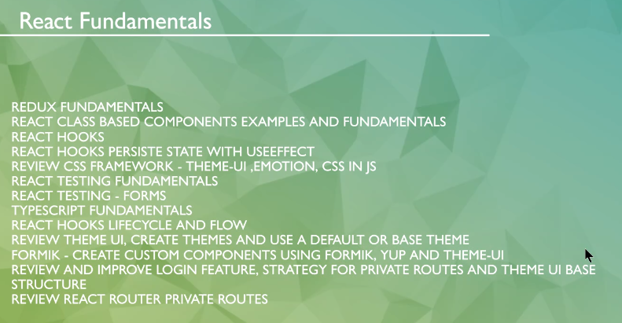
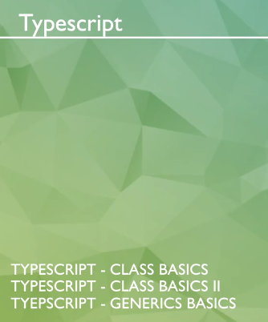
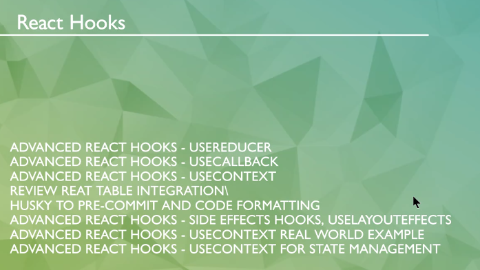
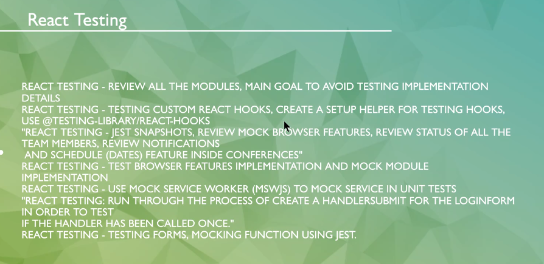
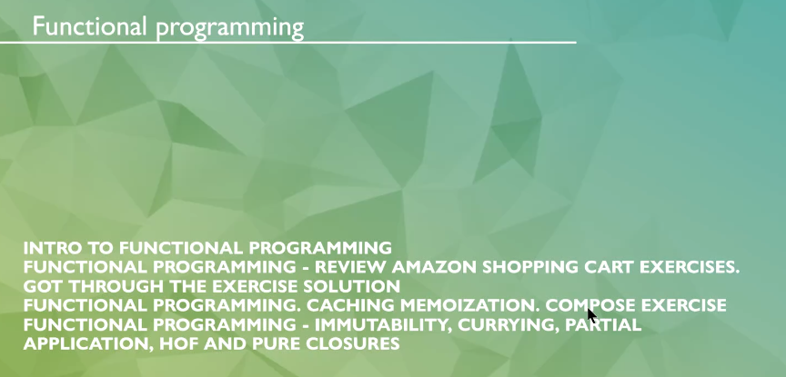
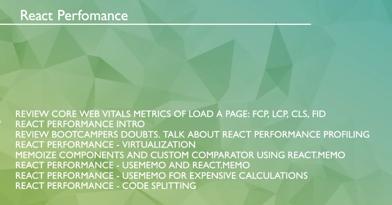
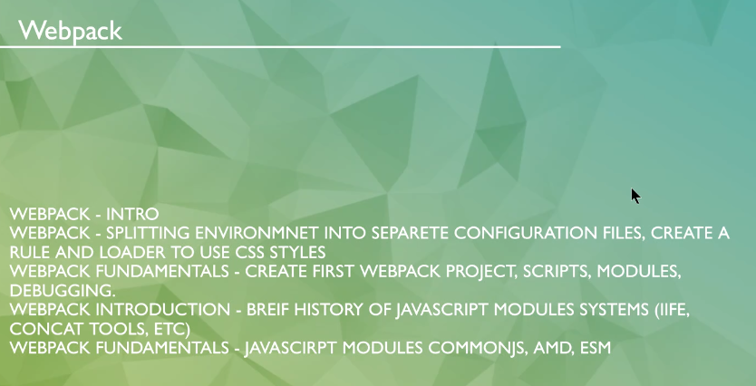

# FRONTEND

## CONTENT

## CLASSES

- [x] 1. JavaScript Bootcamp Content Introduction
- [x] 2. Review JavaScript
- [x] 3. HOF - High Order Functions - and Callbacks
- [x] 4. Clousures
- [x] 5. Promises
- [x] 6. Web Worker
- [x] 7. Architectures - MVVM, Flux, Redux, Component based
- [x] 8. Object & Classes
- [x] 9. Object Prototype
- [x] 10. React Basis with Webpack
- [x] 11. Webpack Configs
- [x] 12. React Class Based Components and Fundamentals
- [x] 13. React Hooks
- [x] 14. React Hooks Persist State
- [x] 15. Babel - Steps to Compile
- [x] 16. React Router DOM
- [x] 17. React Router DOM - BrowserRouter
- [x] 18. Redux
- [x] 19. Redux - Persist
- [x] 20. Redux - Exercises
- [x] 21. TypeScript - Fundamentals
- [x] 22. TypeScript - Fundamentals II
- [x] 23. TypeScript - Methods and Generics
- [x] 24. TypeScript - Generics
- [x] 25. Frameworks - ExpoJS, Gatsby, Next and Vite - with TS
- [x] 26. ESLint, Prettier, interfaces and typing
- [x] 27. Hooks with TS - useMemo, useEffect, useState, useCallback, useDebug, useId, useRef, useLayoutEffect, useImperativeHandle, useContext
- [x] 28. Tests - Unit Test, Smoke Test, E2E Test, Feature Test
- [x] 29. Tests - Jest, Cypress, Vitest
- [x] 30. CSS - A crash course
- [x] 31.
- [x] 31.

## BIBLIOGRAPHICAL REFERENCES

- [1] W3Schools - https://www.w3schools.com/
- [2] Mozilla Developer - https://developer.mozilla.org/en-US/
- [3] TypeScript - https://www.typescriptlang.org/
- [4] React - https://react.dev/
- [5] Angular - https://angular.io/
- [6] Vue - https://vuejs.org/
- [7] Vite - https://vitejs.dev/
- [8] Jest - https://jestjs.io/
- [9] Webpack - https://webpack.js.org/
- [10] Gulp - https://gulpjs.com/
- [11] Redux - https://redux.js.org/
- [12] Redux Toolkit - https://redux-toolkit.js.org/
- [13] Husky - https://typicode.github.io/husky/
- [14] React Testing Library - https://testing-library.com/docs/react-testing-library/intro/
- [15] Mocha - https://mochajs.org/
- [16] Cypress - https://www.cypress.io/
- [17] Vuetify - https://vuetifyjs.com/en/
- [18] MUI - https://mui.com/material-ui/
- [19] Bootstrap - https://getbootstrap.com/docs/5.1/getting-started/introduction/
- [20] TailwindCSS - https://tailwindcss.com/
- [21] Codectome - https://codecto.me/
- [22] ESLint (Sort Imports) - https://eslint.org/docs/latest/rules/sort-imports
- [23] NVM - https://github.com/nvm-sh/nvm/blob/master/README.md
- [24] ASDF - https://asdf-vm.com/
- [25] Rollup - https://rollupjs.org/
- [] CodeWars (test example) - https://www.codewars.com/kata/5b210360bd03075a47001191
- [] Jala Bootcamp 2022 - https://github.com/mateus-vianna/jalabootcamp-fe200222
- [] JalaUniversity Bootcamp 2024 - https://github.com/mawavial/FEBoot03/
- [] JalaIgnite - https://asset-manager.jala.us/login
